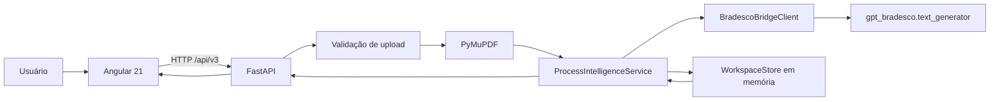

# Arquitetura do AI Ready

## Objetivo

A aplicação transforma um conjunto de PDFs de um processo cível em uma visão única para apoio ao advogado: resumo factual, metadados processuais, partes, pedidos, fatos controvertidos, linha do tempo, pontos de atenção e um chatbot contextualizado.

## Camadas

### Frontend

`frontend/src/app/ai-ready/ai-ready-page.component.ts` concentra a jornada visual. Ele mantém apenas os arquivos selecionados no navegador para visualização local e envia os PDFs ao backend quando o usuário solicita análise.

### Backend

`backend/principal.py` cria a API, middleware e dependências. `backend/routers/processes.py` expõe os endpoints. `backend/services/process_intelligence.py` coordena validação, chunking, consolidação e chat. `backend/services/pdf_text_extractor.py` lê a camada textual do PDF. `backend/services/workspace_store.py` mantém o contexto em memória por tempo limitado.

### Integração corporativa

`backend/services/bradesco_bridge.py` é a única fachada da aplicação para o módulo corporativo. O método `generate_text` termina em `gpt_bradesco.text_generator(payload, llm_parameter)`. URLs, autenticação e TLS permanecem encapsulados em `gpt_bradesco.py`.

## Limites de escopo

Este projeto não contém motor financeiro, atualização monetária, índices financeiros, juros, parcelas, auditoria de pagamentos ou regras automáticas de prescrição. Quando uma pergunta envolver conclusão jurídica, a resposta do chatbot deve ser tratada como hipótese de apoio e validada pelo profissional responsável.
