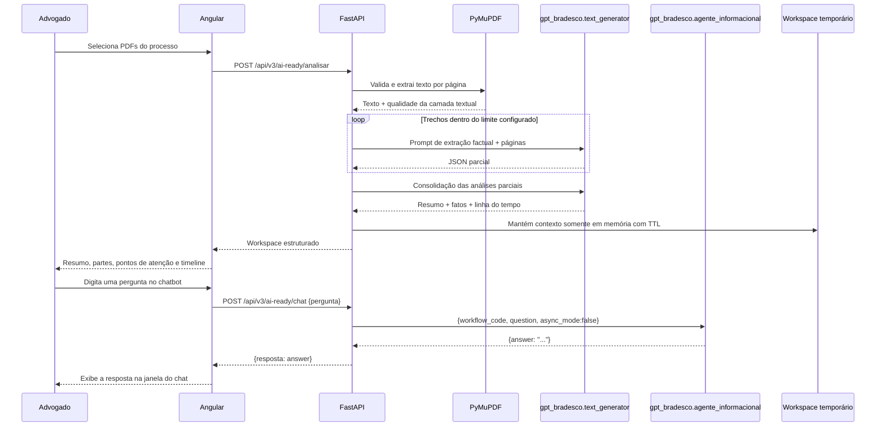

# Fluxo visual do AI Ready

## Decisões importantes

- O PDF é lido localmente com PyMuPDF; o projeto não envia automaticamente o binário para o chatbot.
- A análise documental usa `text_generator`; o chatbot usa `agente_informacional`.
- A pergunta do chatbot é enviada sem reescrita no campo `question`.
- O chat não depende do workspace local dos PDFs.
- O conteúdo textual dos PDFs fica apenas no workspace em memória e expira pelo TTL configurado.
- A interface trata a saída como apoio à revisão; informações críticas devem ser conferidas nas fontes oficiais.
