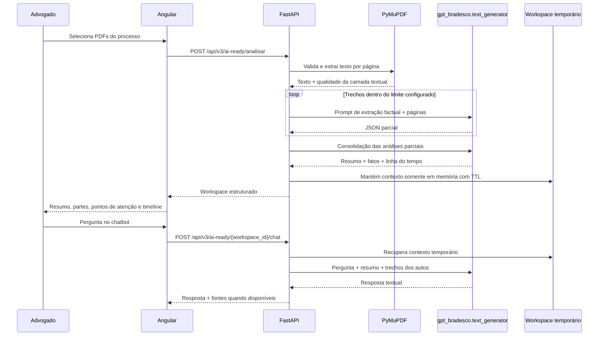

# Fluxo visual do AI Ready

## Decisões importantes

- O PDF é lido localmente com PyMuPDF; o projeto não chama OCR automaticamente nem envia o binário para outro serviço.
- A geração de linguagem passa pela função pública `text_generator` de `gpt_bradesco.py`.
- O conteúdo textual fica apenas no workspace em memória e expira pelo TTL configurado.
- A interface deve tratar a saída como apoio à revisão. Fatos, datas e conclusões relevantes precisam ser conferidos nos autos originais.
